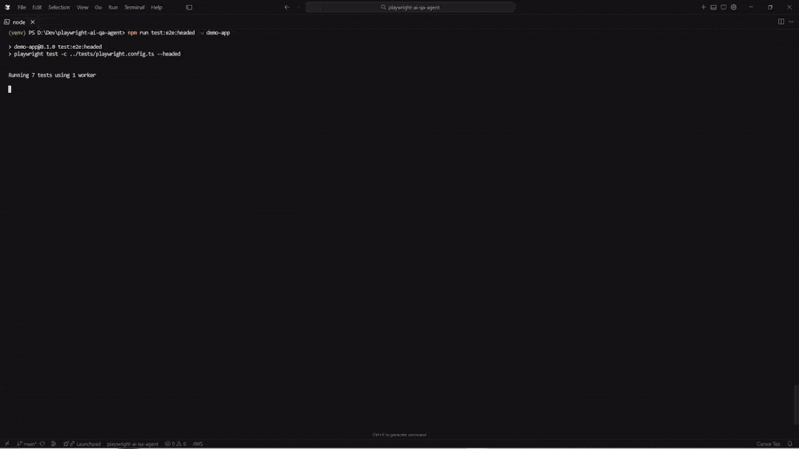

# playwright-ai-qa-agent

AI-powered QA pipeline: Playwright tests + an LLM-driven failure agent that classifies failures and (in later phases) reports bugs or opens healing PRs.

## Badges

[CI](https://github.com/YOUR_ORG/playwright-ai-qa-agent/actions/workflows/playwright.yml) License: MIT Node

## What This Is

When an end-to-end test fails, teams lose time deciding whether the problem is a broken locator, a real regression, flaky timing, or a CI/environment issue. This project turns that decision into a repeatable pipeline step. GitHub Actions runs Playwright and preserves artifacts. The local/dev agent reads failure context from `test-results/results.json` and classifies failures using a configurable provider.

## Demo

Headed Playwright run against TaskFlow with slow motion so the flow is easy to follow.



**Example agent-created issue:** The failure agent can open GitHub Issues from Playwright failures. One example from this repo: [**[BUG] Task creation despite empty input** (Issue #74)](https://github.com/nirarad/playwright-ai-qa-agent/issues/74) — filed when the showcase test `empty input does not create a task` failed (the UI created a task despite empty input; classified as `REAL_BUG`).

## Architecture Diagram

```text
GitHub Actions
  |
  v
Run Playwright tests (JSON + HTML reports, screenshots/traces)
  |
  +-- success ------------------------------> ✅ Job passes
  |
  +-- failure
       |
       v
   Agent reads Playwright results.json + failure context
       |
       v
   Claude API classifies failure
       |
  +--> BROKEN_LOCATOR  ---> create `AUTOMATION_BUG` Issue (+ optional linked healer PR)
       |
       +--> REAL_BUG        ---> create GitHub Issue with failure context
       |
       +--> FLAKY           ---> log only (no automated write action)
       |
       +--> ENV_ISSUE       ---> log only (no automated write action)
       |
       v
   CI ends failed (PR checks are red, artifacts preserved)
```

## Tech Stack


| Layer          | Technology                                                       |
| -------------- | ---------------------------------------------------------------- |
| Test framework | Playwright (`@playwright/test`)                                  |
| Language       | TypeScript (Node runtime)                                        |
| CI             | GitHub Actions                                                   |
| AI model       | Configurable (`mock`, `anthropic`, `openai`, `google`, `ollama`) |
| Bug tracking   | GitHub Issues + Pull Requests                                    |
| Deployment     | Vercel (demo app target)                                         |


## How It Works

1. You deploy a small Next.js demo app (TaskFlow) to Vercel and store its URL in GitHub Secrets so CI has a stable target.
2. GitHub Actions runs Playwright against the deployed app and writes both a JSON results file and an HTML report, including screenshots and traces for failures.
3. The workflow is configured to continue past Playwright failures so the agent step always has access to artifacts.
4. The agent reads `test-results/results.json`, extracts failed test cases, and loads the failing test source from the repo.
5. The agent sends failure context (test name, error, stack, and source) to Claude and requests a strict JSON classification.
6. If the classification is `BROKEN_LOCATOR` and confidence is above a threshold, the agent creates a GitHub Issue titled with `AUTOMATION_BUG` and includes the locator that needs an update plus suggested fix direction.
7. If the classification is `REAL_BUG` and confidence is above a threshold, the agent creates a GitHub Issue with the error details and CI run link.
8. The workflow exits with a failure code if Playwright failed so the check is actionable, while still preserving all artifacts and the agent’s output.

This README is organized into four sections: **Demo app** → **Playwright tests** → **LLM failure agent** → **CI (GitHub Actions)**.

## 1. Demo app (TaskFlow)

TaskFlow is a small Next.js task manager (localStorage, no DB) used as the system under test. It ships **Break Modes** so you can simulate locator bugs, logic bugs, flaky timing, and auth failures.

| Resource | Link |
| --- | --- |
| **Production** | [playwright-ai-qa-agent.vercel.app](https://playwright-ai-qa-agent.vercel.app) |
| **Playwright HTML report (GitHub Pages)** | [nirarad.github.io/playwright-ai-qa-agent](https://nirarad.github.io/playwright-ai-qa-agent/) |

**Build and run locally** (Node 20+; from repository root after `git clone` and `npm ci`):

```bash
cd demo-app
npm install
npm run dev
```

Production build: `npm run build` and `npm run start` inside `demo-app/`, or from the repo root `npm run build` / `npm run start` (workspace scripts target `demo-app`).

**Break modes** (also passed to Playwright as `QA_MODE`):

| Break Mode | What it simulates |
| --- | --- |
| `selector-change` | `data-testid` / DOM changes → automation locators break |
| `logic-bug` | Wrong app behavior → product bug |
| `slow-network` | Artificial latency → timing-sensitive failures |
| `auth-break` | Login always fails |

Optional **browser-only** preset: add `?qaMode=…` to the URL (`none`, `selector-change`, `logic-bug`, `slow-network`, `auth-break`). The value is stored in `sessionStorage` for that tab.

## 2. Playwright test suite

- **Config:** `tests/playwright.config.ts`
- **From repo root:** use `npm run … -w demo-app`
- **From `demo-app/`:** same `npm run test:e2e` / `test:e2e:headed` without `-w demo-app`

Execution parameters:

| Variable | Role |
| --- | --- |
| `BASE_URL` | Target app (default `http://localhost:3000`). Set to the Vercel URL to test production without a local server. |
| `QA_MODE` | Break mode: `none`, `selector-change`, `logic-bug`, `auth-break`, `slow-network`. |
| `PLAYWRIGHT_SLOW_MO` | Optional milliseconds between actions (`slowMo`). Omit or `0` for full speed; use e.g. `400` with **headed** runs when recording. |

Headless run: use `npm run test:e2e -w demo-app` instead of `test:e2e:headed`. **PowerShell** does not support `VAR=value cmd`; use `$env:VAR='…'` below.

**PowerShell** — one session, all parameters, headed run against production:

```powershell
$env:BASE_URL='https://playwright-ai-qa-agent.vercel.app'
$env:QA_MODE='none'
$env:PLAYWRIGHT_SLOW_MO='400'
npm run test:e2e:headed -w demo-app
```

**Bash / Git Bash / WSL / macOS / Linux** — same parameters on one invocation:

```bash
BASE_URL=https://playwright-ai-qa-agent.vercel.app QA_MODE=none PLAYWRIGHT_SLOW_MO=400 npm run test:e2e:headed -w demo-app
```

For a **local** dev server, drop `BASE_URL` or set `BASE_URL=http://localhost:3000`. `$env:` / shell exports last for that terminal session. Built-in video is `retain-on-failure`; set `video: 'on'` in the config if you want a clip per test, or record the headed window externally.

## 3. LLM failure agent

The agent reads Playwright’s JSON report at the **repository root** (`test-results/results.json`; the agent process uses `../test-results/results.json` because `npm run agent` runs with cwd `agent/`), builds failure context, and calls a configurable LLM to classify the failure.

**Setup**

1. From the repository root: `npm ci` (workspaces install `agent/` and `demo-app/`).
2. Add provider keys to `.env` as needed — see [Environment Variables](#environment-variables) (`ANTHROPIC_API_KEY`, `OPENAI_API_KEY`, `GOOGLE_API_KEY`, Ollama URL, etc.). The agent loads **repository root** `.env` first, then `agent/.env` if present; variables already set in the shell are left unchanged. Put `GITHUB_TOKEN` and `GITHUB_REPOSITORY` in the root `.env` for local issue/PR actions.

**Run** (after a test run has produced results; failures are the usual case):

```bash
npm run agent
```

`npm run agent:local-results` (root) runs the agent with debug logs and sets `AGENT_RESULTS_JSON_PATH` to the repo-root Playwright output (`../test-results/results.json` from the `agent/` package cwd). It uses **cmd** `set` syntax. In **PowerShell**, set `$env:AGENT_LOG_LEVEL='debug'`, then `npm run agent` (the default path already points at the repo `test-results/results.json`).

**PowerShell** — mock provider and explicit results path:

```powershell
$env:AI_PROVIDER='mock'
$env:AGENT_RESULTS_JSON_PATH='../test-results/results.json'
npm run agent
```

**PowerShell** — Ollama on `localhost`:

```powershell
$env:AI_PROVIDER='ollama'
$env:AI_MODEL='qwen2.5:7b'
$env:OLLAMA_BASE_URL='http://127.0.0.1:11434'
$env:AGENT_LOG_LEVEL='debug'
$env:AGENT_RESULTS_JSON_PATH='../test-results/results.json'
$env:AGENT_ENABLE_BUG_ISSUE='true'
$env:AGENT_ENABLE_HEAL_PR='true'
npm run agent

# Optional — GitHub Issues for REAL_BUG / BROKEN_LOCATOR / ENV_ISSUE when confidence clears the threshold (token needs `issues:write`):
# $env:AGENT_ENABLE_BUG_ISSUE='true'
# $env:GITHUB_TOKEN='<personal access token>'
# $env:GITHUB_REPOSITORY='owner/repo'
# Optional — healer PR for BROKEN_LOCATOR (same token needs `contents` + `pull-requests`):
# $env:AGENT_ENABLE_HEAL_PR='true'
```

By default **no** issue or PR is created; set the optional `GITHUB_*` variables when enabling issue or healer actions. **`401 Bad credentials`** from the GitHub API means `GITHUB_TOKEN` is missing, expired, or not allowed to access **`GITHUB_REPOSITORY`**—use a token with **`repo`** (classic PAT) or fine-grained access including **Issues** (and **Contents** / **Pull requests** for the healer) on that repository.

**Ollama in Docker** (optional): `docker build -t qa-agent-ollama ./ollama` then `docker run …` or `docker compose -f ollama/docker-compose.yml up --build -d`. See `ollama/` and the **NVIDIA / CPU-only** notes in that folder’s compose files. Point `OLLAMA_BASE_URL` at the container (`http://127.0.0.1:11434` by default).

**Failure classification** (what the LLM returns):

| Category | Typical cause | Automated follow-up (when features are enabled in CI and confidence passes gates) |
| --- | --- | --- |
| `BROKEN_LOCATOR` | Locator / DOM mismatch (`data-testid`, etc.) | `AUTOMATION_BUG` issue; optional healer PR |
| `REAL_BUG` | App logic / assertion failure | GitHub Issue with failure context |
| `FLAKY` | Timing / ordering | Log only |
| `ENV_ISSUE` | Missing env, connectivity, CI config | Log only |

## 4. CI integration (GitHub Actions)

Workflow: [`.github/workflows/playwright.yml`](.github/workflows/playwright.yml).

**Triggers**

- Push to `main` / `develop`
- Pull requests
- **workflow_dispatch** (manual) with inputs: `qa_mode` (`none` | `selector-change` | `logic-bug` | `auth-break` | `slow-network`), optional toggles `enable_agent_reporter` / `enable_agent_healer`, optional `llm_provider` (`anthropic` \| `openai` \| `google`)

**What runs**

1. `npm ci`, install Playwright Chromium (`npx playwright install chromium --with-deps`)
2. `npx playwright test -c tests/playwright.config.ts` with `BASE_URL` set to the public demo and `QA_MODE` from the dispatch input (or `none`). Step uses `continue-on-error: true` so artifacts always upload when tests fail.
3. Upload `test-results/` as an artifact; on pushes to `main` / `develop` (not on `pull_request` events), publish the HTML report to GitHub Pages — see workflow `if:` conditions.
4. **Run AI Failure Agent** only if the Playwright step **failed** and the job was not cancelled — with `AGENT_ENABLE_IN_CI=true`, secrets for LLMs, and repo variables / dispatch inputs controlling issue and healer behavior.
5. A final step **fails the job** if Playwright failed, so the check stays red while preserving reports and agent logs.

Configure **GitHub Secrets** (e.g. `ANTHROPIC_API_KEY`, provider keys) and repository **Variables** as described in the workflow and in [Environment Variables](#environment-variables). Phase 1 may keep some agent write paths off by default; see `AGENT_ENABLE_IN_CI` and related flags in the tables below.

**Manual run:** Actions → *Playwright + AI QA Agent* → *Run workflow*, choose `qa_mode` and optional agent/LLM inputs, then inspect artifacts and the agent step log.

## Project structure

```text
.
├── .cursor/rules/          # Editor / agent conventions
├── .github/workflows/    # CI (Playwright + agent)
├── agent/                  # LLM failure agent (TypeScript)
├── demo-app/               # Next.js TaskFlow app
├── tests/                  # Playwright config + showcase tests
├── ollama/                 # Optional Docker image for local Ollama
└── docs/                   # Design and phase plans
```

## Environment Variables

### Agent and CI (general)


| Variable | Required | Default | Description |
| --- | --- | --- | --- |
| `AGENT_RESULTS_JSON_PATH` | No | `../test-results/results.json` (relative to `agent/` when using `npm run agent`) | Path to Playwright JSON results file |
| `AGENT_CONFIDENCE_THRESHOLD` | No | `0.75` | Minimum confidence gate for downstream decisions |
| `AGENT_MAX_FAILURES_PER_RUN` | No | `3` | Maximum failures to process per run |
| `AGENT_ENABLE_IN_CI` | No | `false` | Enable agent execution in CI (Phase 1 default is disabled) |
| `AGENT_ENABLE_BUG_ISSUE` | No | `false` | Enable GitHub Issue creation when confidence is above threshold |
| `AGENT_ENABLE_HEAL_PR` | No | `false` | Enable healer PR creation for `BROKEN_LOCATOR` when confidence is above threshold |
| `AGENT_ISSUE_LABELS` | No | `bug,automated-qa` | Comma-separated labels applied to created issues |
| `AGENT_GITHUB_BASE_BRANCH` | No | `main` | Base branch for healer PRs |
| `AGENT_INTER_REQUEST_DELAY_MS` | No | `750` | Delay between processing failures |
| `AGENT_LOG_LEVEL` | No | `info` | Log level: `debug`, `info`, `warn`, `error` |
| `AGENT_LOG_PRETTY` | No | `false` | Pretty-print logs with multiline context |
| `GITHUB_API_URL` | No | `https://api.github.com` | GitHub API base URL override (useful for GHES) |
| `DEMO_APP_URL` | Yes (CI) | n/a | Public URL of the deployed TaskFlow app used by Playwright in GitHub Actions |
| `BASE_URL` | No | `http://localhost:3000` | Playwright target (local dev server or deployed URL) |
| `QA_MODE` | No | `none` | Optional mode for showcase test runs (`none`, `selector-change`, `logic-bug`, `auth-break`, `slow-network`) |
| `PLAYWRIGHT_SLOW_MO` | No | unset | Milliseconds between browser operations (`launchOptions.slowMo`) for slower, easier-to-record headed runs |
| `GITHUB_TOKEN` | Yes (CI, provided) | provided by Actions | Used for Issues/PRs GitHub API calls |
| `GITHUB_REPOSITORY` | Yes (CI, provided) | provided by Actions | `owner/repo` used for GitHub API calls |
| `GITHUB_RUN_ID` | Yes (CI, provided) | provided by Actions | Used to construct the CI run URL for linking in Issues/PRs |
| `GITHUB_REF_NAME` | Yes (CI, provided) | provided by Actions | Branch name used in issue context |
| `GITHUB_SHA` | Yes (CI, provided) | provided by Actions | Commit SHA used in issue context |


### LLM routing (all providers)


| Variable      | Required | Description                                                                             |
| ------------- | -------- | --------------------------------------------------------------------------------------- |
| `AI_PROVIDER` | No       | Provider selection: `mock`, `anthropic`, `openai`, `google`, `ollama` (default: `mock`) |
| `AI_MODEL`    | No       | Model name passed to the selected provider                                              |
| `AGENT_MAX_TOKENS_CLASSIFY` | No | Token budget for classification calls (default: `600`) |
| `AGENT_TEMPERATURE_CLASSIFY` | No | Temperature for classification calls (default: `0`) |
| `AGENT_MAX_TOKENS_HEAL` | No | Token budget for healer generation calls (default: `14000`) |
| `AGENT_TEMPERATURE_HEAL` | No | Temperature for healer generation calls (default: `0`) |
| `AGENT_LLM_MAX_ATTEMPTS` | No | LLM request retry attempts (default: `3`) |
| `AGENT_LLM_RETRY_INITIAL_DELAY_MS` | No | Initial retry delay (default: `1000`) |
| `AGENT_LLM_RETRY_MAX_DELAY_MS` | No | Max retry delay cap (default: `8000`) |


### Anthropic (Claude)


| Variable            | Required      | Description                           |
| ------------------- | ------------- | ------------------------------------- |
| `ANTHROPIC_API_KEY` | Conditionally | Required when `AI_PROVIDER=anthropic` |


### OpenAI


| Variable         | Required      | Description                        |
| ---------------- | ------------- | ---------------------------------- |
| `OPENAI_API_KEY` | Conditionally | Required when `AI_PROVIDER=openai` |
| `OPENAI_BASE_URL` | Optional | Override OpenAI API base URL (default: `https://api.openai.com/v1`) |


### Google


| Variable         | Required      | Description                        |
| ---------------- | ------------- | ---------------------------------- |
| `GOOGLE_API_KEY` | Conditionally | Required when `AI_PROVIDER=google` |
| `GOOGLE_BASE_URL` | Optional | Override Google API base URL (default: `https://generativelanguage.googleapis.com/v1beta/models`) |


### Ollama (local)


| Variable                               | Required      | Description                                                                                                           |
| -------------------------------------- | ------------- | --------------------------------------------------------------------------------------------------------------------- |
| `OLLAMA_BASE_URL`                      | Conditionally | Ollama base URL when `AI_PROVIDER=ollama` (default: `http://127.0.0.1:11434`)                                         |
| `OLLAMA_REQUEST_TIMEOUT_MS`            | Optional      | Abort Ollama `/api/generate` after this many ms (`0` or unset = no limit). Large prompts on CPU can take many minutes |
| `AGENT_CLASSIFY_MAX_DOM_CHARS`         | Optional      | Cap DOM snapshot chars in classification prompts for **any** LLM (default `8000`; unset falls back to `AGENT_OLLAMA_MAX_DOM_CHARS`) |
| `AGENT_CLASSIFY_MAX_ERROR_CONTEXT_CHARS` | Optional    | Cap error-context / Playwright error messages in classification prompts (default `6000`; fallback `AGENT_OLLAMA_MAX_ERROR_CONTEXT_CHARS`) |
| `AGENT_CLASSIFY_MAX_TEST_SOURCE_CHARS` | Optional      | Cap test file source in classification prompts (default `10000`; fallback `AGENT_OLLAMA_MAX_TEST_SOURCE_CHARS`)         |
| `AGENT_OLLAMA_MAX_DOM_CHARS`           | Optional      | Legacy alias when `AGENT_CLASSIFY_MAX_DOM_CHARS` is unset (default `8000`)                                            |
| `AGENT_OLLAMA_MAX_ERROR_CONTEXT_CHARS` | Optional      | Legacy alias when `AGENT_CLASSIFY_MAX_ERROR_CONTEXT_CHARS` is unset (default `6000`)                                  |
| `AGENT_OLLAMA_MAX_TEST_SOURCE_CHARS`   | Optional      | Legacy alias when `AGENT_CLASSIFY_MAX_TEST_SOURCE_CHARS` is unset (default `10000`)                                   |
| `AGENT_OLLAMA_MAX_CLASSIFY_PREDICT`    | Optional      | Max decode tokens per classify call for `ollama` (default `384`; lowers latency vs `AGENT_MAX_TOKENS_CLASSIFY`)       |
| `AGENT_OLLAMA_NUM_CTX_MIN`             | Optional      | Lower bound for Ollama `num_ctx` (default `4096`)                                                                     |
| `AGENT_OLLAMA_NUM_CTX_MAX`             | Optional      | Upper bound for Ollama `num_ctx` (default `16384`; trim prompts before raising)                                       |
| `OLLAMA_API_KEY`                       | Optional      | Optional key if Ollama endpoint is behind auth/proxy                                                                  |


## Roadmap

- Make healing POM-aware by including imported page objects in the context prompt
- Attach screenshots to Issues via an artifact link strategy (Issues API does not accept binary uploads)
- Add optional Slack notifications for `REAL_BUG` and repeated `FLAKY` failures
- Add a test-generation agent for new user flows in TaskFlow

## License

MIT